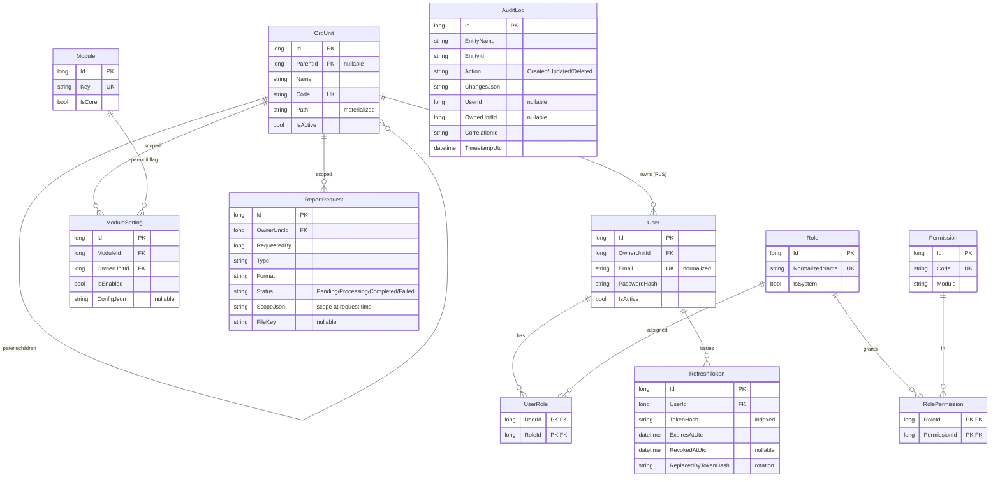

# 12 — مخطّط الكيانات (ERD)

> مُولَّد من الكيانات الفعلية (Phase 1–6). كل كيان قابل للحذف يحمل `IsDeleted/DeletedAtUtc/DeletedBy` + `RowVersion`، والمُدقَّق يحمل `CreatedBy/CreatedAtUtc/UpdatedBy/UpdatedAtUtc`. الحقول أدناه مختصرة على المفاتيح والأعمدة المميِّزة.

## ملاحظات العزل والفهرسة
- **RLS:** الكيانات `IOwnedByUnit` (`User`, `ModuleSetting`, `ReportRequest`) تُصفّى تلقائيًا بـ `OwnerUnitId ∈ نطاق المستخدم`.
- **Soft Delete:** `OrgUnit`, `User`, `Role`, `ModuleSetting`, `ReportRequest` (يرثون `AuditableEntity`).
- **فهارس مميِّزة:** `OrgUnit.Code`/`Path` · `User.NormalizedEmail`(U)/`OwnerUnitId` · `Role.NormalizedName`(U) · `Permission.Code`(U) · `RefreshToken.TokenHash` · `Module.Key`(U) · `ModuleSetting(ModuleId,OwnerUnitId)`(U) · `AuditLog(EntityName,EntityId)`/`TimestampUtc` · `ReportRequest(OwnerUnitId,Status)`.
- جداول **Hangfire** تُدار في schema `HangFire` منفصل (لا تخصّ EF).
